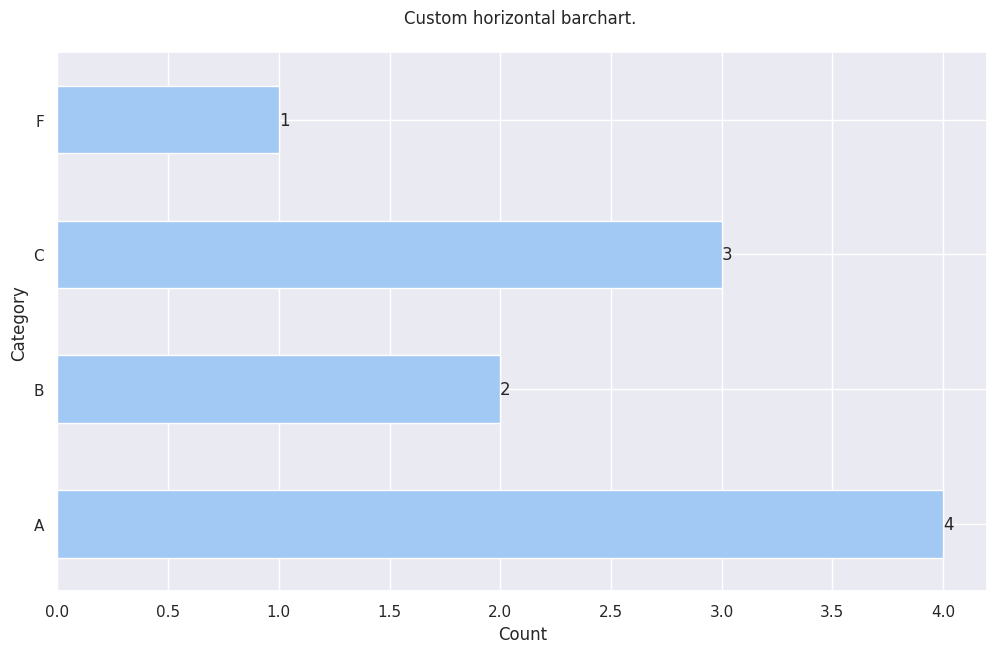

# Milanesas / EDA helper 
---

This package will help you to do some EDA related tasks. 
It will help you to reduce the amount of code needed to do a simple chart. 
Originally intended to work with **Jupyter Lab** but contains some help for **Django**.


## Features

- Functions to draw simple graphs.
- Functions for drawing orizontal and vertical comparative graphs.
- Functions for transforming percentage values.
- Functions for counting unique values.


## Installation

Install my-project with pipy.

```bash
pip install milanesas
```
    
## Usage/Examples

```python
import pandas as pd

import milanesas.eda_helper as eh #Importing the library.


# Create a test dataframe.
df = pd.DataFrame({'Category': ['A', 'B', 'F', 'C'], 'count': [4, 2, 3, 1]})


# Make a horizontal barchart.
eh.make_custom_horizontal_bar(
    df, 
    "col", 
    "Custom horizontal bar chart.", 
    "Count", 
    "Category", 
    False)
```

This simple code will show the following chart.




## License

[MIT](https://choosealicense.com/licenses/mit/)

